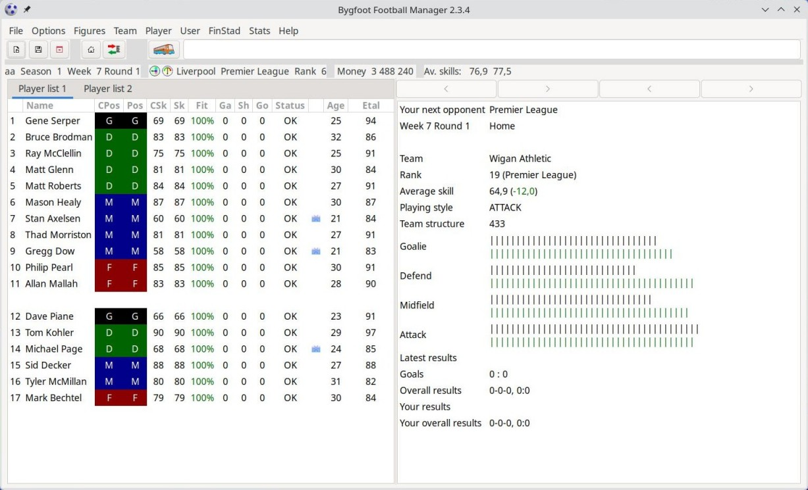

# Bygfoot Football Manager

> **Note:** The original Bygfoot project lives at
> [https://gitlab.com/bygfoot/bygfoot](https://gitlab.com/bygfoot/bygfoot).
> This repository is a GTK 3 port of its 2.3.x branch.

Bygfoot is a simple graphical football (soccer) manager game
featuring many international leagues and cups. You manage a team from one
of these leagues — build your squad, buy and sell players, fight for
promotion and against relegation, and try to win trophies.

## Features

- Many international leagues and cups to choose from
- Player transfers, youth academy, training camps, sponsorship, stadium
  management, loans, and betting
- A live match engine with interactive, per-minute gameplay
- Hotseat multiplayer
- A flexible, XML-driven country/league/cup definition system that is easy to
  extend and fine-tune
- gettext-based internationalization (15 languages)

## Screenshot



## Requirements

This project targets **Linux only**.

- CMake >= 3.13
- GTK+ 3 (`gtk+-3.0`)
- GLib (`glib-2.0`)
- gettext
- zlib
- `pkg-config`

On Debian/Ubuntu, install the dependencies with:

```sh
sudo apt install cmake libgtk-3-dev libglib2.0-dev gettext zlib1g-dev pkgconf
```

## Building

```sh
cmake -S . -B build
cmake --build build
```

This produces `build/bygfoot` and copies the runtime `support_files/` into
`build/support_files/` as a post-build step.

## Installing

```sh
cmake --install build
```

Files are installed under the CMake install prefix, which defaults to
`/usr/local` on Linux. The game binary goes to `<prefix>/bin/bygfoot`, the
runtime data to `<prefix>/share/bygfoot/support_files/`, and translations to
`<prefix>/share/locale/...`.

Installing system-wide typically requires root privileges.

## Running

The game is normally started by launching the `bygfoot` binary from a
directory that contains a `support_files/` folder (or relies on the installed
copy). Support files are searched in the following order, highest priority
first:

1. `<launch cwd>/support_files/`
2. `<launch cwd>/saves/`
3. `~/.bygfoot/`
4. the installed `share/bygfoot/support_files/`

## License

Bygfoot is free software, licensed under the **GNU General Public License
version 2 or (at your option) any later version**. See
[COPYING](legacy/COPYING) for the full license text.

## Authors

Original authors: **Gyozo Both**, **Mark Lawrenz**, and **Ronald Sterckx**.
See [AUTHORS](legacy/AUTHORS) for a full list of contributors.
